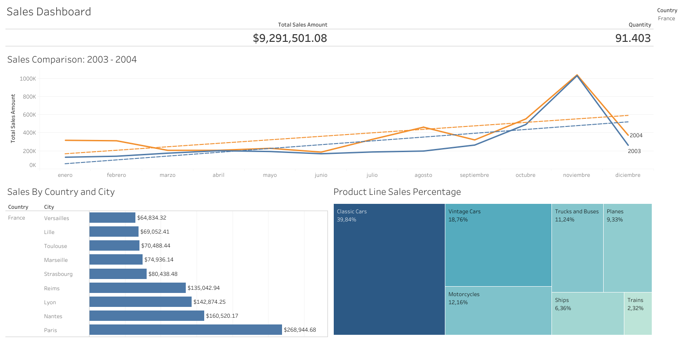

# Sales Performance Warehouse (dbt + DuckDB)

> **An Analytics Engineering project that transforms raw sales data into a strategic steering dashboard using dbt for modeling, DuckDB as the high-performance processing engine, and Tableau for the final visualization.**

---

## Overview

The goal of this project is to build a modern data pipeline to analyze vehicle sales performance. Moving beyond a simple data analysis, I implemented a professional Data Warehouse architecture, applying complex business logic such as market share calculation per category using **SQL Window Functions**.

Originally, the challenge was handling inconsistencies in order statuses and product granularity. My goal was to ensure that every insight on the dashboard was backed by a reliable database; I successfully implemented over 30 automated data tests to validate information quality at every stage of the pipeline.

## Project Documentation

* **Lineage Graph:** The data flow follows a three-layer structure: `Staging` (cleaning), `Intermediate` (business logic), and `Marts` (final tables prepared for BI).
* **Data Quality:** Integrated `dbt_utils` packages to ensure that category share metrics and price ranges remain consistent and accurate.

---

## Key Findings



The comparative analysis between 2003 and 2004 reveals steady growth with a critical seasonal peak in November. Additionally, the **"Classic Cars"** product line dominates the market with nearly **40% of the total share**, validating the importance of focusing inventory efforts on this specific segment.

**Note:** The total sales ($9.2M) and quantity KPIs were validated through dbt aggregation tests to ensure no record duplication occurred after table JOINS.

## Tech Stack

* **dbt (data build tool)** — modeling, testing, and documentation.
* **DuckDB** — high-performance local OLAP database engine.
* **SQL** — transformation logic and Window Functions.
* **Tableau** — data visualization and storytelling.
* **Jinja** — for macros and dynamic SQL within dbt.

## Data Pipeline Architecture

1. **Staging Layer:** Column renaming, data typing, and initial filtering (only 'Shipped' orders).
2. **Intermediate Layer:** Applied `OVER(PARTITION BY ...)` to calculate total sales per category and the percentage share for each product.
3. **Marts Layer:** Consolidation of time dimensions (month, quarter, year) and business metrics ready for BI consumption.

## Quick Start
```bash
# Clone the repository
git clone [https://github.com/miguelvelezsk/vehicle-sales-dbt](https://github.com/miguelvelezsk/vehicle-sales-dbt)
cd vehicle-sales-dbt

# Setup environment
python3 -m venv venv
source venv/bin/activate
pip install dbt-duckdb

# Configure profile (profiles.yml)
cp profiles.yml.example profiles.yml
# Note: Edit profiles.yml if your database path differs

# To run the project
dbt deps
dbt build

# To view documentation
dbt docs generate
dbt docs serve
# Security Note: For educational purposes, a profiles.yml.example file is included. In a production environment, credentials and profiles should be managed outside of the code repository.
```

## Author

**Miguelangel Velez Aguirre**

* Systems Engineering Student at Universidad de Antioquia (UdeA)

* [LinkedIn](https://www.linkedin.com/in/miguelangel-vélez-aguirre-235982168/) | [GitHub](https://github.com/miguelvelezsk)
